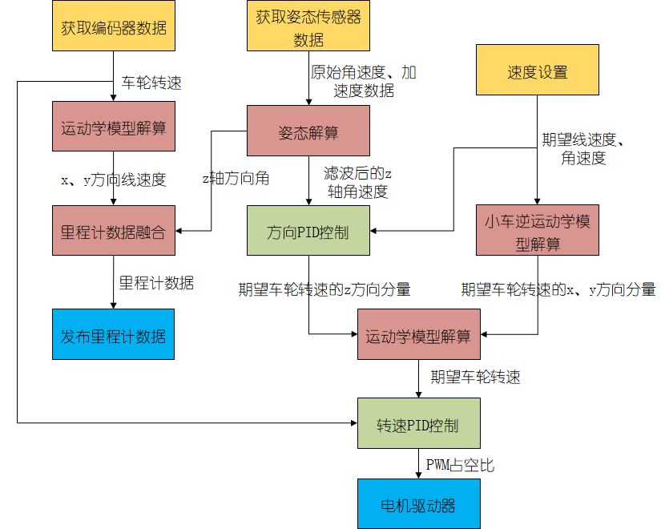

## 软件流程

## 硬件驱动

- ICM20602

  使用LL库的SPI函数获取原始的三轴加速度、三轴角速度数据

- 光电编码器

  使用STM32定时器的编码器模式进行读取

## BOM表

|              名称               |
| :-----------------------------: |
|        STM32G474 Necleo         |
|       ICM20602姿态传感器        |
|         75mm麦克纳姆轮          |
| 直流减速电机(带500线光电编码器) |
|        A4950电机驱动模块        |

注：以上只列举了主要器件，还有部分器件未列出

## Todo List

- [x] 速度控制、方向控制
- [x] 添加Doxygen注释

- [ ] 使用EKF融合轮速计和IMU数据，获得更准确的里程计数据
- [ ] 将里程计数据加入位置控制

