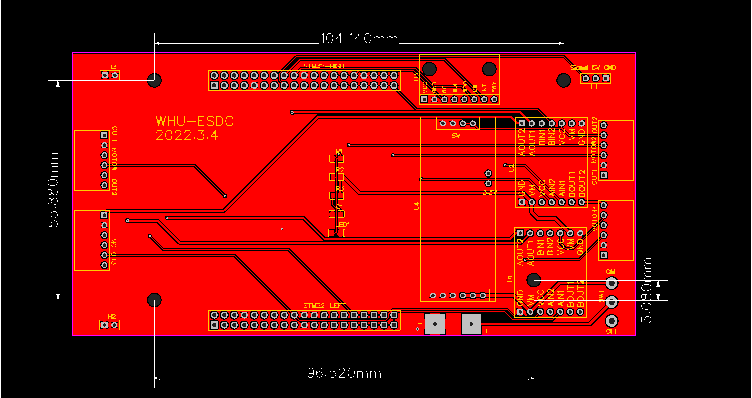

扣除遥控器成本约为1000RMB，`Gerber_PCB_NucleoCar.zip`可直接在嘉立创进行打样

|               名称               |                   链接                   |                   备注                    |
| :------------------------------: | :--------------------------------------: | :---------------------------------------: |
| STM32G474/STM32G491 Nucleo开发板 | https://m.tb.cn/h.fNE8qJR?tk=XjY32fTJZWN |        173RMB x 1 STM32G491RE        |
|    平衡小车之家**A4950**模块     | https://m.tb.cn/h.fmDkUjx?tk=urD92fTlZU4 |     25RMB x 2 单模块驱动两个电机     |
|     平衡小车之家**降压**模块     | https://m.tb.cn/h.fMxn4mm?tk=fBDA2fT9G6Q |       16.8RMB x 1 12V转5V 3.3V       |
|     平衡小车之家**直流电机**     | https://m.tb.cn/h.fnDeYEu?tk=g6322fTNEEK | 81.8RMB x 4 光电款 1:30 12V 带37支架 |
|    平衡小车之家**麦克纳姆轮**    | https://m.tb.cn/h.fMxqcKn?tk=u6v72fTn6xe | 250RMB x 1 1组4个 75mm 不带键槽 6mm  |
|     平衡小车之家**12V电池**      | https://m.tb.cn/h.fMxn4mm?tk=fBDA2fT9G6Q |    99RMB x 1 3S 3500mAh 带充电器     |
|     逐飞科技**ICM20602**模块     | https://m.tb.cn/h.fNE8aOR?tk=RHJb2fTpZu2 |                41.5RMB x 1                |
|      SS12D06G5**拨动开关**       |                    /                     |                     /                     |
|     富斯I6S 10通道**遥控器**     | https://m.tb.cn/h.fMxJt6n?tk=2KrB2fTMq4b |       349RMB x 1 配iA10B接收机       |
|          XH2.54 6P座子           |                    /                     |                 4个 弯针                  |

PCB预览：

